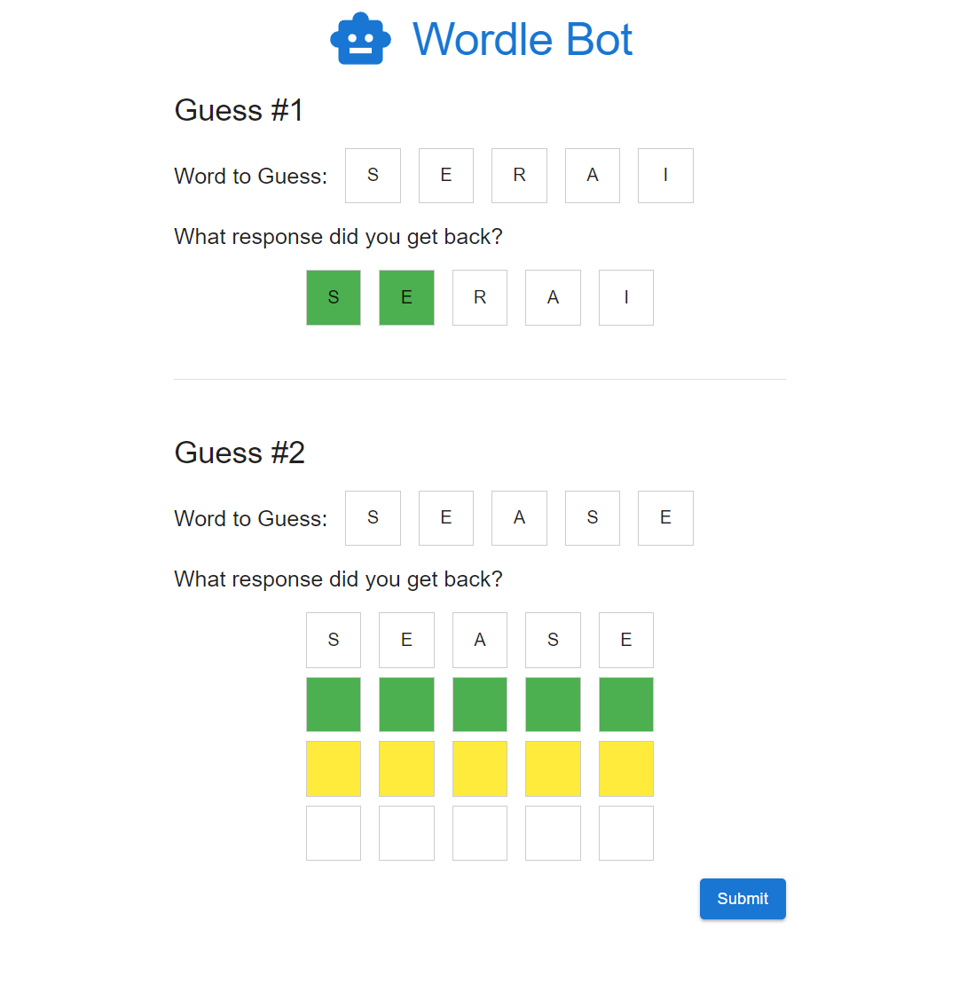
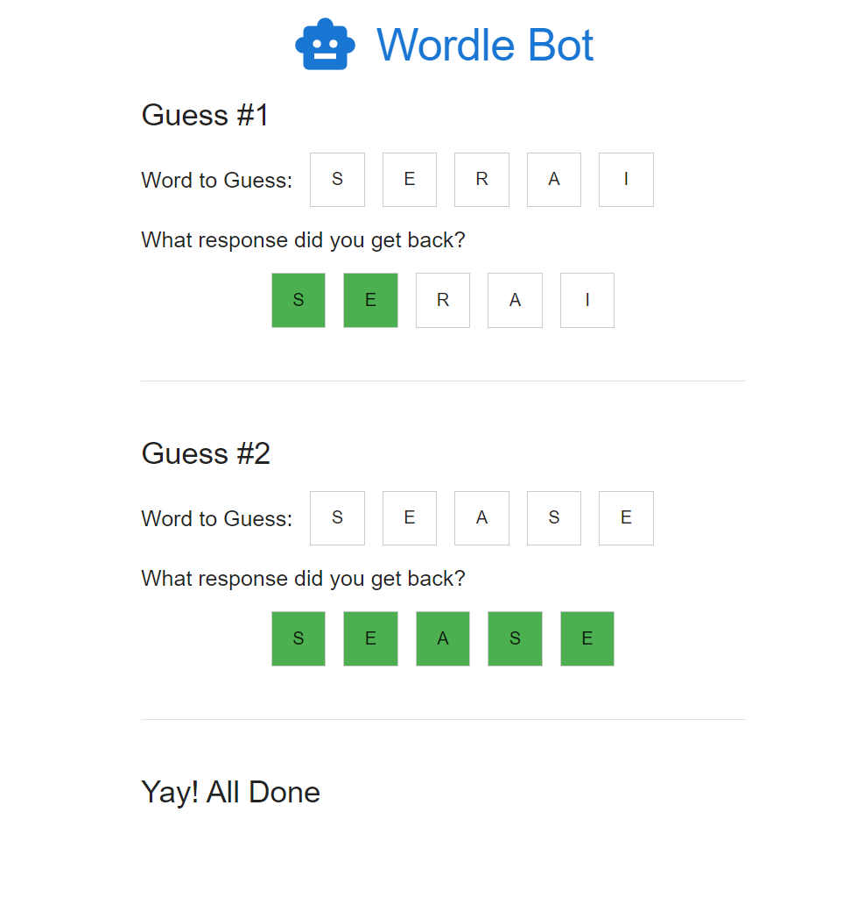
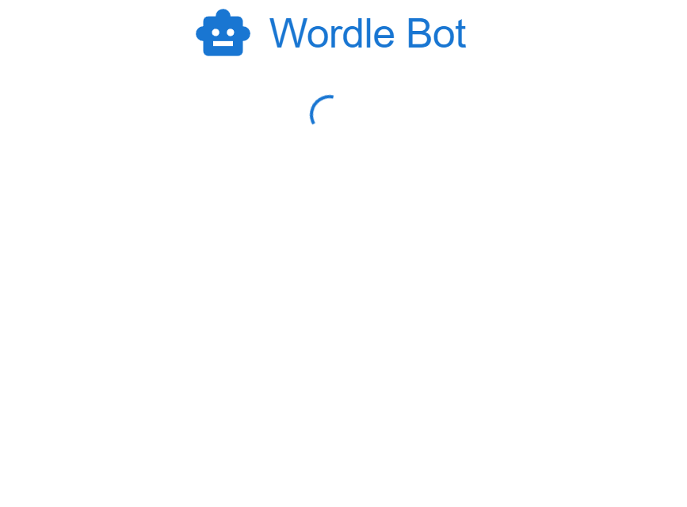
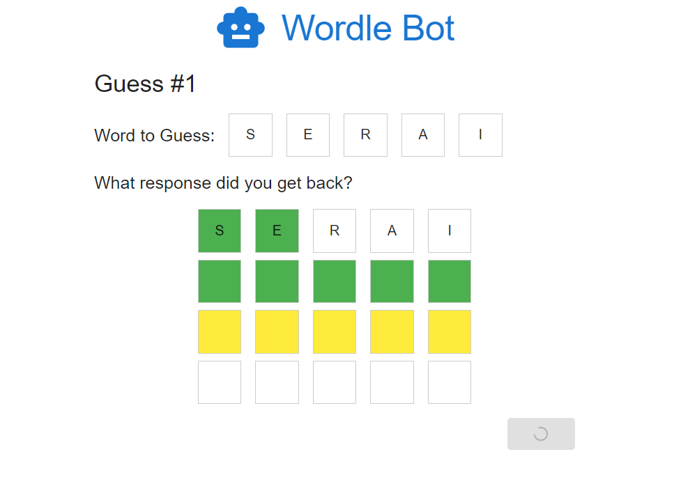
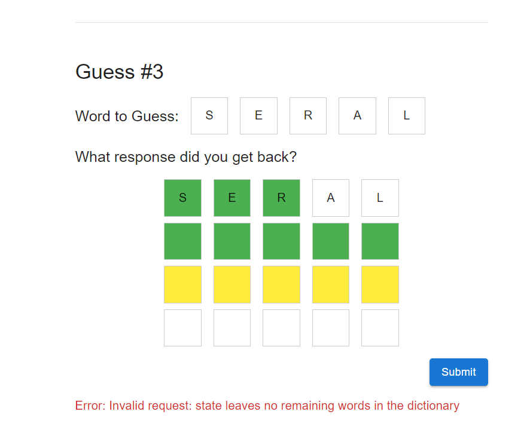

# Wordle Bot Technical Take Home

Congrats on making it to our technical evaluation!  To help us understand your capabilities and familiarity with the front-end technologies we use, we've put together a fun little project for you - a Wordle Bot.

Your task is to create a user interface for our Wordle solver API that gives the user recommendations for each guess in solving a Wordle.  If you you aren't familiar with Wordle, you can play a game here: [https://nytimes.com/games/wordle/index.html]([Wordle](https://nytimes.com/games/wordle/index.html)).

The user flow is as follows:
1. The user gets a suggestion from the bot for the initial word to guess.
2. In a separate tab/window, the user enters the word into their game of Wordle and gets the color-coded clue (green, yellow, and white clues) in response.
3. The user enters in the clue they received and submits it to the bot.
4. The bot responds with the next word to guess.
5. Steps 2-4 are repeated until the all boxes are green (winning the game) or all 6 guess attempts are used (losing the game).


You'll be expected to build and deploy a working application that uses the API.  This app has been designed to be no more than a few hours from start to finish.  Below are various details that you may find helpful in completing the project.

## Functional Requirements

1. Users should see an initial guess loaded from the API.
2. Users should be able to enter in the puzzle clues back from Wordle, which will provide a new suggestion to the user.
3. Upon submitting all greens, display a success message to the user and don't show or solicit any more suggestions.
4. Users should have responsive feedback when the app is interacting with the server.
    - Loading indicator while fetching the initial guess
    - When submitting clues to the API, the submit button should be disabled and the user should have a loading indicator.
5. Errors from the API should be displayed to the end user and handled appropriately.


## Example Visuals

The goal of this project is to test your capabilities around implementing a web application.  To help, below are some sample visuals to help you understand the requirements.  You are welcome to change the user experience as you see desire so long as it meets the above functional requirements.

### Iterating through the guesses


### Completing the puzzle


### Handling initial load


### Handling submission load


### Error Handling


## API Details

Endpoint:
POST https://interviewing.venteur.co/api/wordle

This endpoint will return the next guess from the wordle bot based upon the history of all clues-word pairs.

request body schema:

```tsx
type WordleRequestItem = {
	word: string;
	clue: string;
};

type WordleRequest = WordleRequestItem[];
```

response body schema:

```tsx
type WordleResponse = {
	guess: string;
}
```

sample request:

```tsx
[
	{
		"word": "serai",
		"clue": "gxyxx"
	}
]
```

sample response:

```tsx
{
	"guess": "barye"
}
```

There is some level of validation on the request object. Attempts to pass invalid input will likely end in an error. Examples:

| Error | Example message |
| --- | --- |
| Empty request body | Invalid request: must have a valid state object as the HTTP body |
| Request is not an array | Invalid request: state must be an array |
| Passing in too many items (6 or more) | Invalid request: state must be an array with 0-5 items in it |
| Array entry is not an object | Invalid request: state item at index 0 is not a valid object |
| Array entry is missing 'word' field OR 'word' field is not a string OR 'word' field is not 5 characters long | Invalid request: state item at index 0 does not have a 'word' string property that is 5 characters long |
| 'word' field is not 5 alpha (a-z, A-Z) characters | Invalid request: state item at index 0 has a 'word' string property with invalid characters |
| Array entry is missing 'clue' field OR 'clue' field is not a string OR 'clue' field is not 5 characters long | Invalid request: state item at index 0 does not have a 'clue' string property that is 5 characters long |
| 'clue' field is not 5 clue (g, G, y, Y, x, X) characters | Invalid request: state item at index 0 has a 'clue' string property with invalid characters |
| The requested items eliminates all the words in the dictionary (i.e. not solvable) | Invalid request: state leaves no remaining words in the dictionary |

## Project Details

In this repo, we've included a starter project with some of the technologies we use - React, Typescript, and Material UI.  The goal of the starter is to help accelerate the project and reduce the overall time commitment while focusing on the user experience requirements.  If you are comfortable with other libraries or methods of accomplishing functionality in the starter, please use what is comfortable for you.

To run this project, you can use `npm start`  This will run the app in development mode at http://localhost:3000

## Deployment Details

We largely use Azure and below we'll cover deployment instructions using a free Azure account.  If you are comfortable deploying on other platforms (AWS, Netlify, etc), you are welcome to choose your own hosting provider.

### Azure Instructions
Azure offers free services to all users as long as your usage remains below a quota. If you are not hosting anything in Azure yet, deploying your project there will be free. If you are using Azure already and have usage exceeding your free quota, deploying your project should only add pennies of cost to your monthly bill.

The instructions assume you are using this starter project as the basis for your project. You may need to adjust them if you are using a different framework.

1. Create a free Azure account or use an existing Azure account.
2. Create a **Storage Account** in your subscription.  Standard storage and Local Redundancy is sufficient.
3. In the storage account, on the left nav, click **Data Management > Static Website**.
4. Enable the static website feature and set both index document name and error document name to ```index.html```.
5. In the left nav under **Data Storage > Containers**, click into the ```$web``` container.
6. On your local machine, create a production React build with `npm run build`.
7. Upload the contents of `/build` into the ```$web``` container such that ```index.html``` and the associated react files are at the root of the container.
8. Go to the primary endpoint listed in the **Static Website** page

We are not expecting your submission to be hosted behind a custom domain; the Azure assigned domain (`https://example.z19.web.core.windows.net/`) is sufficient.

## Submission

Please "reply all" to the thread that sent you this assessment invitation. In your reply, include the following:
1. Github repo link of the project
2. Link to the hosted web app
3. In a few paragraphs, explain your key design choices and implementation. Include any notes you wish to let us know as we review your project.


